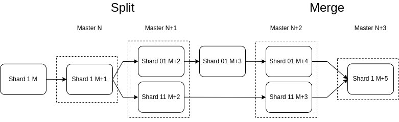

# Technical notes

- [Glossary](#Glossary)
- [Limitations](#Limitations)
- [API blueprint](/docs/api.apib)
- [Wallets generation](#Wallets-generation)
- [Healthcheck](#Healthcheck)
- [Transfers layouts](#Transfers-layouts)
- [Withdrawal mechanism](#Withdrawal-mechanism)
- [Shard tracker algorithm](#Shard-tracker-algorithm)
- [Block scanner algorithm](#Block-scanner-algorithm)
- [Restart policy](#Restart-policy)
- [Service withdrawals](#Service-withdrawals)
- [Calibration parameters](#Calibration-parameters)
- [Freezing and deleting unused accounts](#Freezing-and-deleting-unused-accounts)
- [Highload wallet message deduplication](#Highload-wallet-message-deduplication)
- [Audit log](#Audit-log)
- [Sharding](#Sharding)
- [Running the test util for payment processor](#Running-the-test-util-for-payment-processor)

## Glossary
* `sharding` - when the network needs to process a large number of account transactions, in order to distribute the load, 
accounts begin to be grouped into separate blocks (shard blocks). The shard block contains accounts that have the same 
bit prefix in the address.
* `subwallets` - a wallets (addresses) derived from the same seed but with a different subwallet_id.
* `jetton_wallet_owner` - TON wallet (Highload V2 for hot) OR special proxy contract owner of the jetton wallet smartcontract.
* `ext_msg` - external in message in TON blockchain
* `int_msg` - internal message in TON blockchain
* `external wallet` - some wallet not hot and not deposit
* `internal withdrawal` - withdrawal from deposit wallet to hot wallet
* `external withdrawal` - withdrawal from hot wallet to external wallet
* `internal income` - transfer from deposit wallet to hot wallet
* `external income` - transfer from external wallet to deposit wallet
* `external withdrawals processor` - service that performs external withdrawals
* `internal withdrawals processor` - service that performs internal withdrawals
* `expiration processor` - service that tracks expired and unconfirmed withdrawals
* `block scanner` - service that extracts and decodes transactions and messages from blocks
* `shard tracker` - utility for receiving blocks from blockchain with custom shard prefix

## Limitations
* Supports up to 256 shards only
* Supports only 0 workchain
* For deposit addresses used only 32 byte addr_std 
* Var address of senders saves as nil
* Withdrawals to deposit addresses is prohibited
* Manual withdrawals from hot wallet is prohibited **do not withdraw funds from a hot wallet bypassing the service, this will lead to a service error**

### Sub-wallets (deposit) qty limitation
- `subwallet_id` Go type: `uint32` (postgresql bigint type)
- `max(uint32) = 4294967295`
- `default_subwallet_id = 698983191` (for main hot wallet)
- DB numeration starts from default `subwallet_id`
- part of wallets in shard (for 1 byte shard prefix): 1/256
- maximum qty of subwallets: `(max(uint32) - default_subwallet_id)/256 = 14_046_812`

## Wallets generation
1. Generates `hot_ton_wallet` (if needed) from seed phrase as Highload V2 wallet. The first byte of the address define the shard.
2. Generates `hot_jetton_wallet` for each Jetton. (not in shard) `hot_ton_wallet` - owner for all of this jetton wallets.
3. Generates `deposit_ton_wallet` as V3R2 from hot wallet seed phrase and subwallet_id to set the desired shard.
4. Generates `jetton_wallet_owner` as proxy contract with `hot_ton_wallet` address as owner and subwallet_id to set the desired shard for `deposit_jetton_wallet`.

## Healthcheck
1. Checks time on liteserver after start. If service-liteserver time diff > configured value then service not starts. To avoid fail of message expiration checks.
2. REST API provides method to check blockchain sync flag.

## Transfers layouts

### Replenishment of the TON deposit by payer
Standard case. Instead of `payer_ton_wallet` there may be another smart contract.
1. `ext_msg` -> `payer_ton_wallet`
2. `payer_ton_wallet` -> `msg (internal)` -> `deposit_ton_wallet`

### Replenishment of the Jetton deposit by payer
Standard case. Instead of `payer_jetton_wallet_owner` there may be another smart contract.
1. `ext_msg (payload = transfer)` -> `payer_jetton_wallet_owner`
2. `payer_jetton_wallet_owner` -> `int_msg (value > fees, body = transfer)` -> `payer_jetton_wallet`
3. `payer_jetton_wallet` -> `int_msg (body = internal_transfer, init)` -> `deposit_jetton_wallet`
4. *optional* `deposit_jetton_wallet` -> `int_msg (value = excesses, body = excesses)` -> `response_destination`
5. *optional* `deposit_jetton_wallet` -> `int_msg (body = transfer_notification)` -> `deposit_jetton_wallet_owner`

### Withdraw TONs from deposit to hot wallet
1. `ext_msg (init, mode = 128 + 32, comment = memo)` -> `deposit_ton_wallet` // init wallet, send all TONs and destroy
2. `deposit_ton_wallet` -> `int_msg (value = all_TONs, body = memo)` -> `hot_ton_wallet`

### Withdraw Jettons from deposit to hot wallet
1. `ext_msg` -> `hot_ton_wallet`
2. `hot_ton_wallet` -> `int_msg (init, value > fees, body = msg_with_transfer_body)` -> `deposit_jetton_wallet_owner` // fees for notify and excesses. init of proxy contract
3. `deposit_jetton_wallet_owner` -> `int_msg (mode = 128 + 32, body = transfer, comment = memo, forward_ton_amount > fees)` -> `deposit_jetton_wallet`
4. `deposit_jetton_wallet` -> `int_msg (jetton_value = all_jettons, forward_ton_amount > fees, body = internal_transfer, comment = memo)` -> `hot_jetton_wallet`
5. `hot_jetton_wallet` -> `int_msg (body = transfer_notification, comment = memo)` -> `hot_ton_wallet`
6. `hot_jetton_wallet` -> `int_msg (value = excesses, body = excesses)` -> `hot_ton_wallet`

## Withdrawal mechanism

### Criteria for successful withdrawal

#### TON internal withdrawal
1. Incoming int_msg with unique memo is found at hot_ton_wallet
2. Transaction is success (message not bounced and computation phase is success)

#### Jetton internal withdrawal
1. Incoming transfer_notification int_msg with unique memo is found at hot_ton_wallet (as owner of hot_jetton_wallet) 

#### TON external withdrawal
1. Outgoing int_msg is found at hot_ton_wallet. Transaction success on the receiver's side is not checked! (it depends on user request)

#### Jetton external withdrawal
1. Incoming int_msg (excesses) with unique query_id is found at hot_ton_wallet (as response destination address)

### Algorithm of internal withdrawal
1. Get transactions on deposit_wallets from blockchain and save to DB as external incomes
2. Periodically get last (by LT) external income for deposit from DB
3. Check for pending internal withdrawals in DB
4. If there is no pending internal withdrawals and last success internal withdrawal LT < last external income LT then create internal withdrawal task
5. Check balance of deposit wallet
6. If balance > minimum value for withdrawal then save internal withdrawal task to DB with sinceLT = last external income LT, expiration time and unique memo
7. Make withdrawal message with memo and send
8. *Get message from blockchain (out in_msg for TON withdrawal or success transfer in_msg for Jetton) and save to DB `finish_lt` and `failed` if needed
9. ** Mark expired (and not found in blockchain) withdrawals in DB as `failed`
10. Get internal income (success in_msg for TON or transfer_notification in_msg for Jetton) from blockchain at hot_wallet 
11. Save internal income to DB

*- There is a specific behavior for TON withdrawal. When we make a withdrawal with the 128+32 mode from deposit wallet (i.e. the destruction of the account), 
we reset its data and seqno. However, the external message may be in node mem-pool for some time (about 10 minutes). If during this time the account balance is replenished,
then this message will apply again by creating a duplicate message with the same memo. On the hot wallet side, we scan all messages with a unique (memo+LT). For withdrawal in DB we save
total amount and last LT for memo.

**- Since the message lifetime refers to an external message to the wallet, and the success of the withdrawal of Jettons 
is checked in the transaction on the Jetton wallet, then in order to correctly check expiration, it is necessary to save 
the time/Lt of the intermediate transaction (on hot wallet). If the entire transaction chain ends up in one block, 
then the order in which the intermediate and final messages are saved will also be important.

### Using a proxy contract to withdraw Jettons
If a regular wallet (V3R2, which is stored in an empty state to avoid storage fees) is used as the jetton_wallet_owner, then the withdrawal of Jettons takes place in three stages.
1. Replenishment of a jetton_wallet_owner from hot wallet
2. Waiting for the replenishment to arrive and the account status will be uninit
3. Sending a Jetton transfer message

To avoid such a complex sequence of actions, a proxy contract is used as the jetton_wallet_owner. This proxy forwards Jetton transfer message from hot wallet and self destroy.
In order for the Jetton wallet to have a suitable address for the shard, the proxy contract applies subwallet_id.

[Proxy contract source code](https://github.com/gobicycle/ton-proxy-contract)

### Algorithm of external withdrawal
1. Get batch of TON withdrawal requests from DB with different destination addresses (in raw form) 
2. Mark withdrawal requests as `processing` in DB
3. Make ext_msg for hot_ton_wallet with withdrawals and expiration time
4. Save withdrawals, ext_msg uuid (as part of msg hash) and expiration time to DB
5. Send ext_msg
6. Get transaction with ext_msg from blockchain
7. Get out messages from transaction, save and mark correlated withdrawals as `processed` in DB
8. If some withdrawals is presented in ext_msg and not presented in out in_msg - mark correlated withdrawals as `failed` in DB
9. For Jetton withdrawals: get transaction with excesses in_msg with unique query_id from blockchain and mark correlated withdrawal as `confirmed` in DB
10. Mark expired (and not found in blockchain) withdrawals in DB as `failed` and reset withdrawal requests `processing` flag

## Block scanner algorithm
1. Get next shard block with custom shard prefix from shard tracker
2. Get TxIDs for block
3. Filter TxIDs by known addresses
4. Get TXs from blockchain by TxIDs
5. Decode TXs and messages and save to DB
6. Goto 1.

### Nuances of detecting Jetton transactions
Since the contract code of Jetton wallets can be different, and the standard describes only the format of the transfer 
message (the internal transfer is not standardized), and there may be no excess and notification messages, that is, 
the nuances of detecting Jetton transactions. Transactions are tracked on the deposit Jetton wallet. 
If there is a transfer notification message in the transaction, then it is decoded and the decoded data is stored 
in the database. But since there may be events that change the balance of the wallet (depending on the wallet code), 
the balance is additionally checked for the previous block and the current one, the known value is subtracted and the 
result is written to the database in the form of replenishment with an unknown sender.

## Restart policy
The service must be resistant to restart and long downtime. 
All operations before being sent to the blockchain must be saved in the database with the status and expiration time.
Withdrawal processors and expiration processor are suspended until the block scanner is synchronized. 
The block scanner is considered synchronized when (now - last_saved_block_gen_utime) < custom preset. 

## Service withdrawals
Method for service withdrawals available. The method is used in the following cases:
#### 1. Mistaken transfer of TONs to the address of the proxy contract (the owner of the deposit Jetton wallet) when the TONs are still there
If an internal withdrawal has already been made from the Jetton wallet, then the tones from the contract proxy 
should have already returned to the hot wallet and no additional actions are needed. 
Use `/v1/withdrawal/service/ton` if the TONs are still at proxy contract. It makes direct withdrawal of all TONs from 
proxy contract to hot wallet.
#### 2. Mistaken transfer of Jettons to the address of TON deposit
Use `/v1/withdrawal/service/jetton`. It makes withdrawal of all Jettons from Jetton wallet (not deposit) to hot wallet.
**! Be careful with this method.** This method withdraw all TONs from deposit to hot wallet, but balance replenish at 
hot wallet side not detect. Use this method with zero or near zero deposit TON balance.
#### 3. Mistaken transfer of unexpected Jetton type to the address of the proxy contract
Use `/v1/withdrawal/service/jetton`. It makes withdrawal of all Jettons from Jetton wallet (not deposit) to hot wallet.

## Calibration parameters
### TESTNET
Single highload message Jetton transfer to not deployed Jetton wallet (SCALE Jetton): 
- transfer message value - 0.1 TON
- forward TON amount - 0.02 TON (for notification message)
- excess - 0.033 TON
- total loss = 0.1 - 0.033 = 0.067 TON

Single highload message Jetton transfer to already deployed Jetton wallet (SCALE Jetton):
- transfer message value - 0.1 TON
- forward TON amount - 0.02 TON (for notification message)
- excess - 0.042 TON
- total loss = 0.1 - 0.042 = 0.058 TON

### MAINNET

Single highload message Jetton transfer to not deployed Jetton wallet (TGR Jetton):
- transfer message value - 0.1 TON
- forward TON amount - 0.02 TON (for notification message)
- excess - 0.033 TON
- total loss = 0.1 - 0.033 = 0.067 TON

Single highload message Jetton transfer to not deployed Jetton wallet (FNZ Jetton):
- transfer message value - 0.1 TON
- forward TON amount - 0.02 TON (for notification message)
- excess - 0.022 TON
- total loss = 0.1 - 0.022 = 0.078 TON

## Freezing and deleting unused accounts
If account do not used by a long time, and its balance under 0 by storage fee, this account freezes (by the next transaction) 
and then deletes by node (by the next transaction if balance still < 0).
It is dangerous for Jetton wallets (hot and cold) and when account data drops Jetton balance drops too.
Recommended to check hot and Jetton wallet balances periodically and fill it (or use special software).

## Highload wallet message deduplication
In order to check the success of sending separate messages in a batch, we need to identify them.
Adding a memo to a message to make it unique distorts the user's comment.
Use control of the uniqueness of the destination address in the batch instead of adding memo.
Destination address is a message dest address for TON transfers, and it is a destination from ton transfer message payload 
for Jetton transfer (to avoid deduplication by the Jetton hot wallet address).
Because the wrapped payload is sent to the proxy contract, then the destination address is the address of the proxy
contract (for service and internal Jetton withdrawals).

## Audit log
There is an audit log to detect anomalous service behavior and unusual events in the blockchain. Service errors of a 
technical nature fall into the ordinary log. The audit log message contains the location where the event was detected, 
the transaction hash (if this event was detected by the block scanner) and the text of the message.

There are three levels of warnings:
* INFO - the event is not dangerous, but unusual
* WARNING - the event may be potentially hazardous and should be attended to
* ERROR - the event can pose a critical threat to the operation of the service

## Sharding
### Examples of block shard_prefix from lite client
* `0000 100000000000000000000000000000000000000000000000000000000000`
* `0001 100000000000000000000000000000000000000000000000000000000000`
* `0010 100000000000000000000000000000000000000000000000000000000000`

### Only one shard example
* ` 1000000000000000000000000000000000000000000000000000000000000000` OR `0x8000000000000000`
  It is equivalent of empty bitstring.

### Default SHARD
We use a variable-size address prefix (N bits). The first N bits of 256 bit std_address (not workchain) and workchain = 0.
And all addresses will be in the same shard up to 2^N shards.
The default `SHARD` value is taken from the hot wallet address. Hot wallet address generates from seed phrase and default subwallet_id.
If the shard prefix length is greater than the specified by configuration, then the shard tracker keeps track of all sub shards.

#### Example:
* `hot_ton_wallet_address = 0:60573d8db98cc369b7ce4ca1dadbfcbd17e82952938857a6cf14e1f8d77c811a` (raw form)
* `SHARD = 01100000` (0x60)
* `address_binary_prefix = 01100000` (for all deposit-addresses)

##### Suitable block shard prefixes (for these addresses):
* ` 1000000000000000000000000000000000000000000000000000000000000000` - 1 shard
* `0110 100000000000000000000000000000000000000000000000000000000000`  - 16 shards
* `01100000 10000000000000000000000000000000000000000000000000000000`  - 256 shards
* `011000000 1000000000000000000000000000000000000000000000000000000`  - sub shard
* `011000001 1000000000000000000000000000000000000000000000000000000`  - sub shard

##### Not suitable block shard prefixes (for these addresses):
* `0010 100000000000000000000000000000000000000000000000000000000000`  - invalid prefix

### Scheme for committing workchain blocks in the masterchain


## Shard tracker algorithm

1. Load the last known masterchain (MC) block (in there are no saved blocks in DB, then get the last MC block)
2. Get all workchain (WC) blocks from this MC block and save it as last known WC blocks
3. Get next MC block by seqno
4. Get all WC blocks from this MC block
5. Filter WC blocks by custom shard prefix
6. Save filtered WC blocks to batch
7. Get parent blocks (and save it to batch) for each filtered WC block recursively until find already known WC block
8. Clear last known MC blocks variable and save WC blocks from current MC block as last known
9. Return batch of MC blocks
10. Goto 3

**Attention, a batch of blocks may not be ordered by time, which means it must be processed atomically, because otherwise, 
synchronization may be lost and double output may be performed.**

## Running the test util for payment processor
**It is strictly recommended to run the test utility with the processor configured for the testnet.**

Optionally you can start test environment for payment-processor. This utility generates deposits via API, 
sends TONs and Jettons from `payment-processor A` to deposits of `payment-processor B` and vice versa. 
Thus, the utility circulates TONs and Jettons in a closed loop between 
`payment-processor A`->`payment-processor B`->`payment-processor A`. 
The utility also allows to evaluate the loss of TONs for the circulation of funds, check the completeness of 
the withdrawals and the presence of double withdrawals of funds.

### Configurable parameters
| ENV variable           | Description                                                                                            |
|------------------------|--------------------------------------------------------------------------------------------------------|
| `LITESERVER`           | same as for payment-processor A and B (must be the same for A and B)                                   |
| `LITESERVER_KEY`       | same as for payment-processor A and B (must be the same for A and B)                                   |
| `DB_URI`               | same as for payment-processor A                                                                        |
| `HOST_A`               | host of payment-processor A, example `payment_processor_a:8081`                                        |
| `HOST_B`               | host of payment-processor B, example `payment_processor_b:8081`                                        |
| `API_TOKEN`            | same as for payment-processor A and B (must be the same for A and B)                                   |
| `IS_TESTNET`           | same as for payment-processor A and B (must be the same for A and B)                                   |
| `JETTONS`              | same as for payment-processor A and B (must be the same for A and B)                                   |
| `TON_CUTOFFS`          | same as for payment-processor A and B (must be the same for A and B)                                   |
| `HOT_WALLET_A`         | hot-wallet address for payment-processor A, example `kQCdyiS-fIV9UVfI9Phswo4l2MA-hm8YseH3XZ_YiH9Y1ufw` |
| `HOT_WALLET_B`         | hot-wallet address for payment-processor B, example `kQCdyiS-fIV9UVfI9Phswo4l2MA-hm8YseH3XZ_YiH9Y1ufw` |
| `CIRCULATION`          | `true` for funds circulation in closed loop. Default: `false`.                                         |

To turn on TON and Jetton circulation set `CIRCULATION=true` ENV variable.
If you need only balance monitoring without TON and Jetton circulation set `CIRCULATION=false` ENV variable.

1. The test util image of the utility is built from the same makefile as the payment processor
```console
make -f Makefile
```
2. Prepare `.env` file for `payment-postgres` A and B services or fill environment variables in `docker-compose-test.yml` file.
   Database scheme automatically init.
```console
docker-compose -f docker-compose-test.yml up -d payment-postgres-a
docker-compose -f docker-compose-test.yml up -d payment-postgres-b
```
3. Prepare `.env` file for `payment-processor` A and B services or fill environment variables in `docker-compose-test.yml` file.
Seeds for A and B must be different.
```console
docker-compose -f docker-compose-test.yml up -d payment-processor-a
docker-compose -f docker-compose-test.yml up -d payment-processor-b
```
4. Start Grafana for services monitoring. Prepare `.env` file for `payment-grafana` service or
   fill environment variables in `docker-compose-test.yml` file.
```console
docker-compose -f docker-compose-test.yml up -d payment-grafana
```
5. Start `payment-prometheus` container
```console
docker-compose -f docker-compose-test.yml up -d payment-prometheus
```
6. Prepare `.env` file for `payment-test` service or fill environment variables in `docker-compose-test.yml` file.
```console
docker-compose -f docker-compose-test.yml up -d payment-test
```